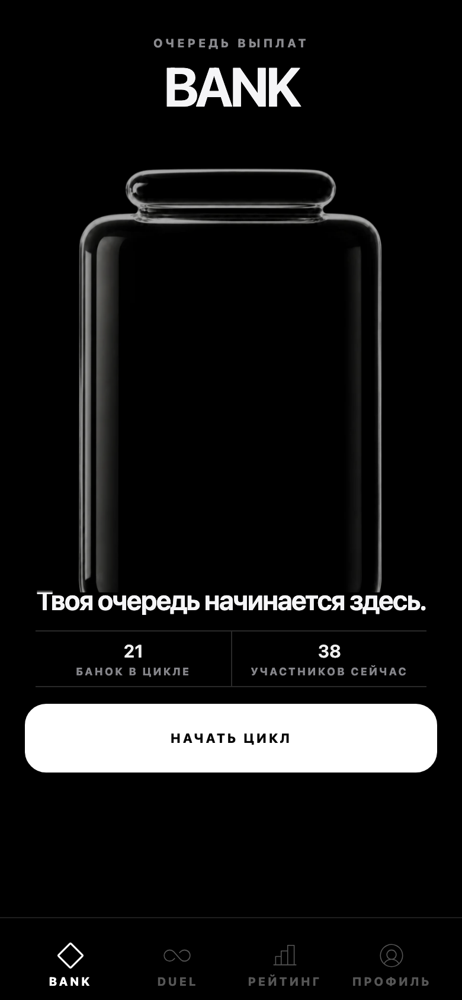
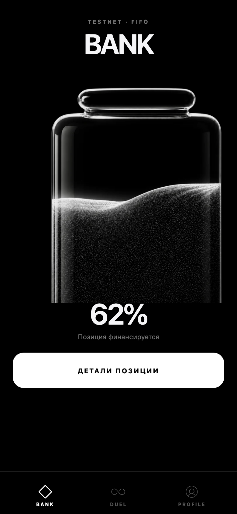
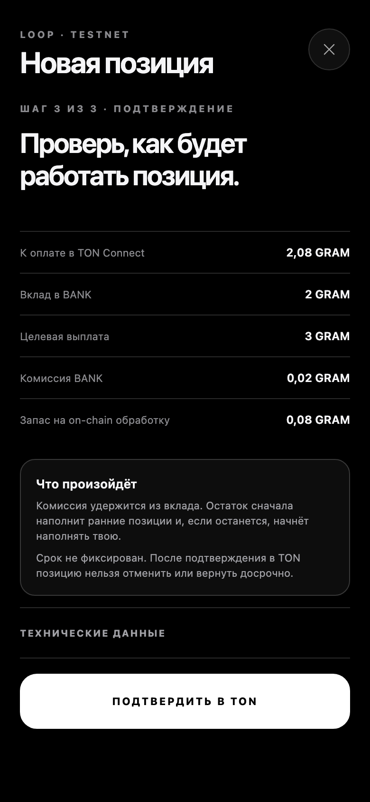
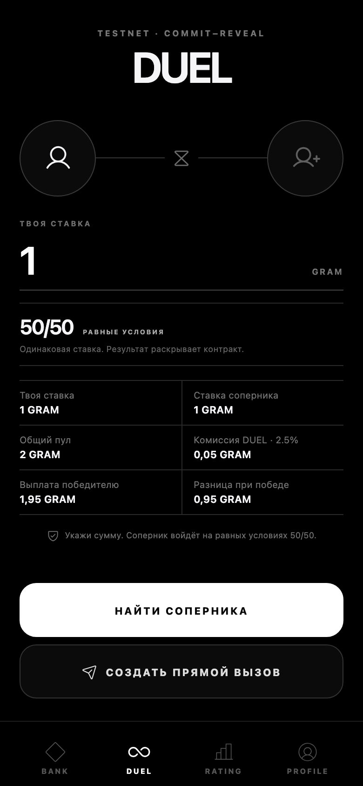
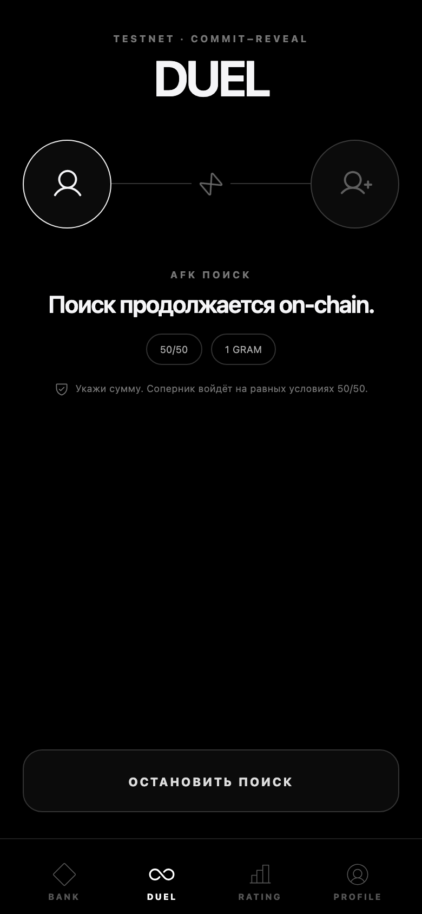
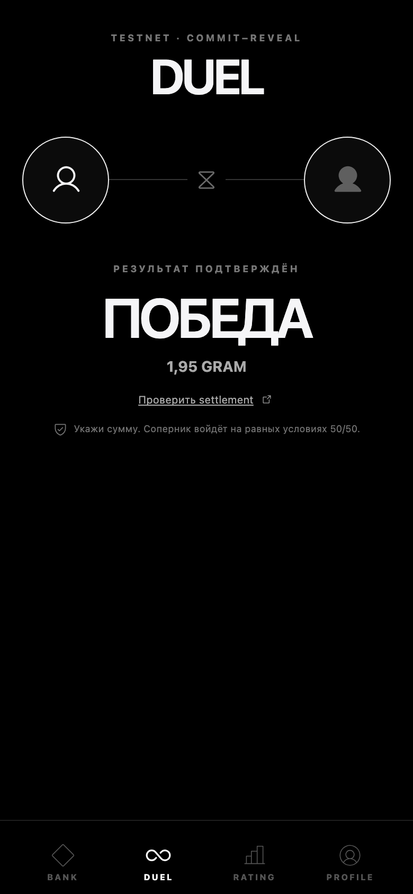
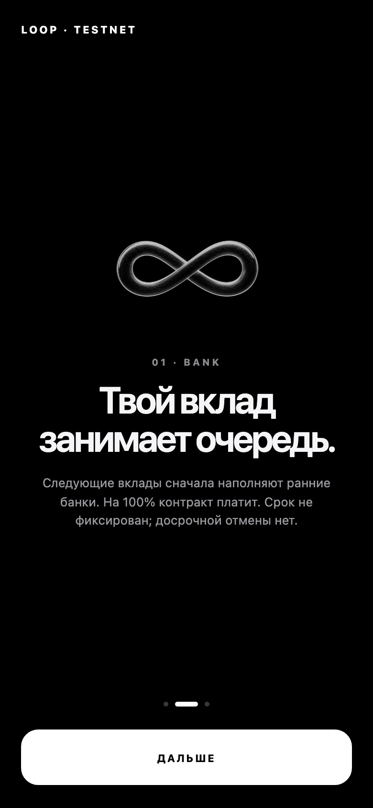
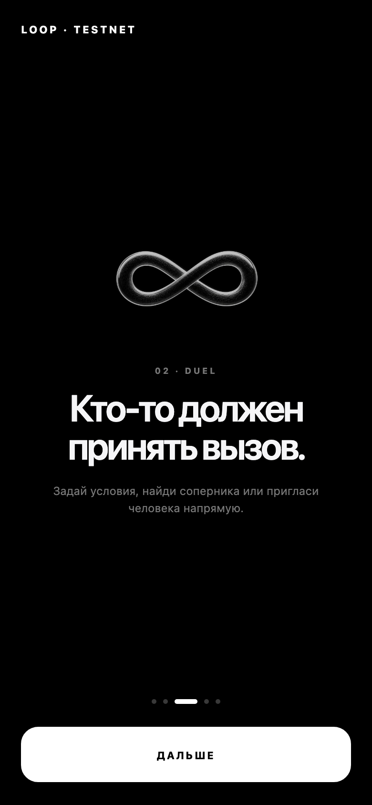
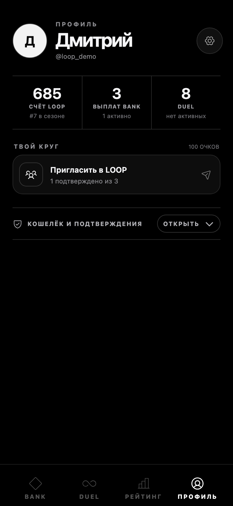

# LOOP

LOOP — Telegram Mini App с двумя независимыми режимами в TON testnet.

**BANK** — открытая тестовая симуляция FIFO-пирамиды. Пользователь создаёт позицию и выбирает целевую выплату; следующие депозиты последовательно финансируют более ранние позиции. Доход не гарантирован: если новые позиции не появляются, очередь останавливается.

**DUEL** — отдельная PvP-игра. Два пользователя блокируют тестовые GRAM в escrow-контракте, выбирают шанс 25%, 50% или 75%, а результат фиксируется через commit–reveal. Победителю автоматически отправляется общий пул за вычетом комиссии.

LOOP не является кошельком и не хранит внутренний баланс. TON Connect подключает внешний кошелёк только для подписания транзакций и получения выплат. On-chain состояние — источник истины.

[](https://github.com/rub1kub/loop/actions/workflows/ci.yml)
[](docs/contracts.md)
[](LICENSE)

## Demo

- Mini App: <https://app.tonsuite.org>
- Telegram: <https://t.me/getloopbot>
- BANK: [`kQCr…KvX81`](https://testnet.tonviewer.com/kQCrJa3LWrkb7iKbz5aZQw8dWl7zo2McsZah8YB2uPQKvX81)
- DUEL: [`kQDV…Ydu3Tw`](https://testnet.tonviewer.com/kQDVeChmpyLsgjLZRLW-gtwSS4s5depJWpBhuYkfhgYdu3Tw)

> В опубликованной версии используются только тестовые GRAM. Не отправляйте mainnet-активы на адреса testnet.

## Product preview

| BANK: пустая очередь                           | BANK: активная позиция                           | BANK: создание позиции                                             |
| ---------------------------------------------- | ------------------------------------------------ | ------------------------------------------------------------------ |
|  |  |  |

| DUEL: условия                                    | DUEL: AFK-поиск                                            | DUEL: результат                                  |
| ------------------------------------------------ | ---------------------------------------------------------- | ------------------------------------------------ |
|  |  |  |

| Onboarding BANK                                          | Onboarding DUEL                                          | Profile                                  |
| -------------------------------------------------------- | -------------------------------------------------------- | ---------------------------------------- |
|  |  |  |

## What is implemented

- FIFO BANK contract with 1.25×, 1.5× and 2× targets, partial funding, cascading settlement, deterministic fee and automatic payouts.
- DUEL v1.1 escrow with canonical 25/75, 50/50 and 75/25 terms, domain-separated commit–reveal, permissionless timeouts, refunds and replay protection.
- AFK matchmaking with durable reservations and direct Telegram invites cryptographically bound on-chain to the invited wallet.
- Independent BANK and DUEL models, API routers, database tables, chain event logs and checkpoints.
- Fail-closed chain worker: verifies sender, destination, value, opcode, identifiers, terms, exit status and masterchain finality before projecting state.
- Telegram auth, TON ownership proof, idempotency, rate limits, referrals and independent BANK/DUEL history.
- Monochrome responsive UI with Telegram safe areas, black header/bottom chrome, haptics and reduced-motion support.

## Architecture

```text
Telegram Mini App
       │ signed initData / TON Connect request
       ▼
 FastAPI + aiogram
   ├── BANK API ─── BANK tables ─── BANK chain events
   ├── DUEL API ─── DUEL tables ─── DUEL chain events
   ├── referrals / wallet proof / Telegram inline
   └── finalized chain worker
              │
        TON testnet
        ├── BankQueue
        └── DuelEscrow
```

PostgreSQL stores projections and Telegram product state. Redis stores disposable locks and rate limits. The contracts, not the API or wallet callback, decide financial state.

Read [product](docs/product.md), [architecture](docs/architecture.md), [BANK](docs/bank.md), [DUEL](docs/duel.md) and [contracts](docs/contracts.md).

## Stack

| Layer        | Technology                                          |
| ------------ | --------------------------------------------------- |
| Mini App     | React 19, TypeScript, Vite, Motion, TON Connect UI  |
| API and bot  | FastAPI, aiogram, SQLAlchemy, Alembic, Pydantic     |
| Data         | PostgreSQL 17, Redis 8                              |
| Contracts    | Tolk 1.4, Acton 1.0, TVM                            |
| Verification | pytest, Vitest, Playwright, Ruff, mypy, Acton tests |
| Delivery     | Docker Compose, nginx, immutable releases           |

## Local setup

Requirements: Node.js 22+, Python 3.12+, Docker and Acton 1.0.

```bash
cp .env.example .env
make setup
```

Start the web app:

```bash
VITE_MOCK_TELEGRAM=true make dev
```

Start PostgreSQL, Redis, API and worker with production-like settings:

```bash
cp .env.example .env.production
make docker-up
```

The browser mock contains no real authentication or transaction signing and is never enabled in production.

## Quality commands

Discover all supported commands:

```bash
make help
```

Run code checks:

```bash
make lint
make typecheck
make test
make test-e2e
make test-security
```

Build and verify both contracts against finalized testnet state:

```bash
make contracts-build
make contracts-test
make contracts-verify
make contracts-inspect
```

Generate screenshots from the production build:

```bash
make screenshots
```

See [testing](docs/testing.md) for suite boundaries and [setup](docs/setup.md) for configuration.

## Deployment

Production releases are immutable. Deployment builds the API and web bundle, backs up PostgreSQL, runs Alembic, starts API and worker, validates contract code hashes, then checks internal and public readiness.

```bash
make deploy RELEASE=<40-character-git-sha>
make smoke-test
```

Full runbook: [deployment](docs/deployment.md).

## Security and honest limits

- BANK is intentionally a pyramid simulation. Payouts depend on later deposits and can stop indefinitely.
- BANK always funds older FIFO positions first; any remainder visibly seeds the new position instead of becoming trapped protocol reserve.
- DUEL v1.1 has one global 2.5% on-chain fee. PLUSH BRICK ownership is verified, but a holder discount is disabled until a contract version can enforce it on-chain across networks.
- Financial contracts run on testnet, while the configured PLUSH BRICK Jetton exists on mainnet; the two proofs are explicitly separated.
- LOOP holds no user balance, seed phrase, private key or custodial wallet; two isolated low-value testnet keys are used only by the production DUEL canary.

Read [security](docs/security.md) and report vulnerabilities according to [SECURITY.md](SECURITY.md).

## Contributing

Changes use Conventional Commits and must pass the affected checks. See [CONTRIBUTING.md](CONTRIBUTING.md) and [CHANGELOG.md](CHANGELOG.md).

## License

[MIT](LICENSE)
