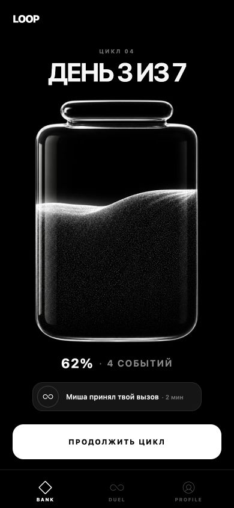
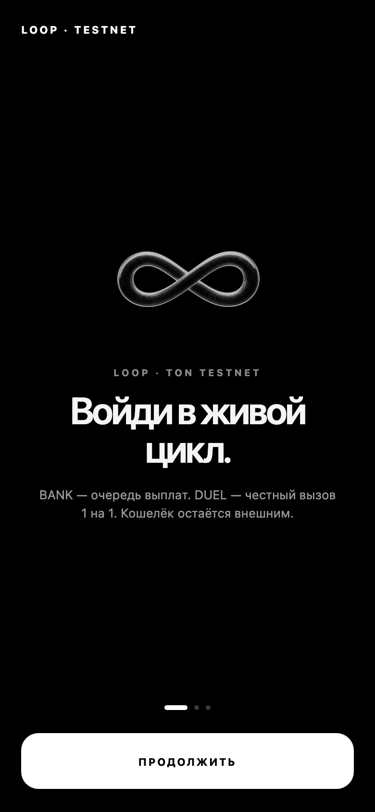
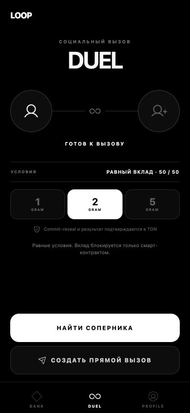
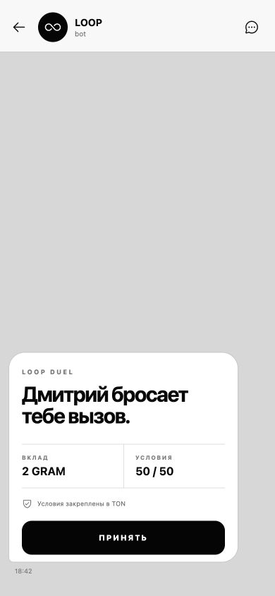

# LOOP

LOOP is a Telegram Mini App powered by TON that combines social games and transparent on-chain interactions.

LOOP is not a wallet. It is a live social cycle built around **BANK**, **DUEL**, and Telegram-native invitations. Users connect an external wallet only when they need to sign a transaction, receive a payout, or prove ownership of an asset. LOOP never creates a wallet and never holds an internal user balance.

[](https://github.com/rub1kub/loop/actions/workflows/ci.yml)
[](LICENSE)
[](docs/ton.md)



## Demo

- Mini App: <https://144-31-30-62.sslip.io>
- Telegram bot: <https://t.me/getloopbot>
- Verified testnet contract: [`kQBXddZVMOteEYD87uSOfIAPL3P4UuI0Vf_fUAyGLS5l212a`](https://testnet.tonviewer.com/kQBXddZVMOteEYD87uSOfIAPL3P4UuI0Vf_fUAyGLS5l212a)

The public environment is testnet-only. Do not send mainnet assets to the published address.

## Screenshots

| Onboarding                                          | Loader                                      | BANK                                    |
| --------------------------------------------------- | ------------------------------------------- | --------------------------------------- |
|  |  |  |

| DUEL                                    | Profile                                       | Telegram inline duel                                                    |
| --------------------------------------- | --------------------------------------------- | ----------------------------------------------------------------------- |
|  |  |  |

## Features

- **BANK — the living jar.** A seven-day social cycle grows through verified events: starting a cycle, funding or matching a duel, settlements, refunds, invitations, and social activity.
- **DUEL — a challenge, not a casino screen.** Two people participate on equal 50/50 terms. Contributions are locked by the contract, never by the application.
- **AFK matchmaking.** A user confirms the terms once and may close LOOP while the backend looks for a compatible opponent.
- **Telegram-native invitations.** Inline messages and direct links preserve the exact on-chain offer; the accepting user sees who challenged them, the contribution, and the fixed conditions.
- **Blockchain proof.** Funding, matching, settlement, and refund events include transaction hashes and explorer links after masterchain inclusion.
- **External wallet only.** TON Connect is limited to connection, ownership proof, transaction confirmation, and payouts.
- **Monochrome product language.** The UI uses black, white, gray, restrained motion, native safe areas, and Telegram haptics.

## Architecture

```text
Telegram Mini App / inline message
              │ signed initData + HTTPS
              ▼
       FastAPI + aiogram
       ├── BANK cycle service
       ├── DUEL matchmaking
       ├── Telegram outbox
       └── TON proof API
              │
      PostgreSQL ── Redis
              │
       finalized chain worker
              │
     TON testnet + DuelEscrow
              │
       external user wallets
```

TON is authoritative for locked value and duel outcomes. PostgreSQL stores Telegram identity, matchmaking intent, idempotent projections, BANK events, and delivery state. Redis is disposable and is used only for rate limits, locks, and cache.

See [architecture](docs/architecture.md), [product model](docs/product.md), and [TON audit](docs/ton.md).

## Technology

| Layer          | Stack                                                              |
| -------------- | ------------------------------------------------------------------ |
| Mini App       | React 19, TypeScript, Vite, Motion, TON Connect UI, Phosphor Icons |
| API and bot    | FastAPI, aiogram, Pydantic, SQLAlchemy, Alembic                    |
| Data           | PostgreSQL 17, Redis 8                                             |
| Smart contract | Tolk, Acton, TVM                                                   |
| Delivery       | Docker Compose, nginx, Apache SNI edge, GitHub Actions             |
| Quality        | Vitest, Playwright, pytest, Ruff, mypy, Acton tests                |

## Setup

Requirements: Node.js 22+, Python 3.12+, PostgreSQL 17+, Redis 8+, and Acton 1.0.0.

```bash
cp .env.example .env
npm ci
npm run dev:web
```

Run the API in a second terminal:

```bash
python3.13 -m venv .venv
.venv/bin/pip install -e 'apps/api[dev]'
.venv/bin/uvicorn app.main:app --app-dir apps/api --reload
```

For a browser-only product preview, set `VITE_MOCK_TELEGRAM=true`. Production rejects unsigned Telegram identity. Full instructions are in [setup](docs/setup.md).

## Verification

```bash
npm run check
.venv/bin/ruff check apps/api
.venv/bin/mypy apps/api/app
.venv/bin/pytest apps/api/tests --cov=app --cov-fail-under=60
acton fmt --check
acton check
acton test --coverage --coverage-format text --coverage-minimum-percent 75
```

Read-only on-chain verification is available from the installed API package:

```bash
.venv/bin/loop-onchain-audit contract
.venv/bin/loop-onchain-audit wallet --address <wallet-address>
.venv/bin/loop-onchain-audit transaction --hash <tx-hash> --account <account-address>
.venv/bin/loop-onchain-audit jetton --owner <wallet-address> --master <jetton-master>
```

## Deployment

Releases are immutable and testnet-only. GitHub Actions builds the web app, API, and contract tests before the release is uploaded and activated. The server validates migrations, health endpoints, nginx configuration, and the configured contract code hash before traffic switches.

```bash
docker compose --env-file .env.production build api
docker compose --env-file .env.production up -d --wait db redis
docker compose --env-file .env.production run --rm migrate
docker compose --env-file .env.production up -d api worker
```

See [deployment and operations](docs/deployment.md). Mainnet remains disabled until the documented audit, governance, legal, recovery, and backup gates are complete.

## Security

- No seed phrase or private key is requested, generated, stored, or logged.
- Telegram `initData` and TON ownership proofs are verified server-side and expire quickly.
- A wallet callback is only “submitted”; social and financial state changes only after a successful transaction is included in a masterchain-confirmed block.
- Pausing prevents new offers and matches but cannot block cancellation, reveal, settlement, or permissionless timeout recovery.
- Production startup fails if the configured contract is inactive or its code hash differs from the audited build.

Read the [security model](docs/security.md) and report vulnerabilities according to [SECURITY.md](SECURITY.md).

## Documentation

- [Product](docs/product.md)
- [Architecture](docs/architecture.md)
- [Setup](docs/setup.md)
- [Telegram integration](docs/telegram.md)
- [TON integration and audit](docs/ton.md)
- [Deployment and operations](docs/deployment.md)
- [Design QA](design-qa.md)

## Contributing

Please read [CONTRIBUTING.md](CONTRIBUTING.md). Changes use Conventional Commits and must pass the relevant web, API, and contract checks.

## License

[MIT](LICENSE)
