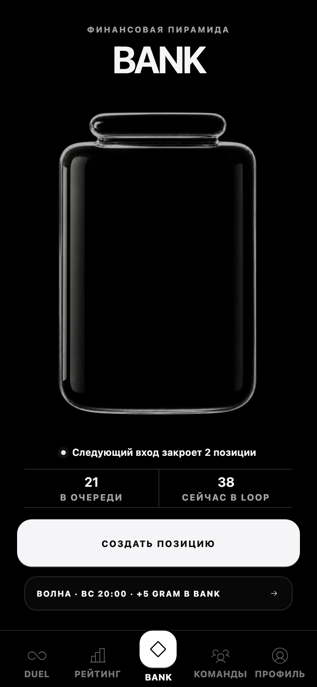
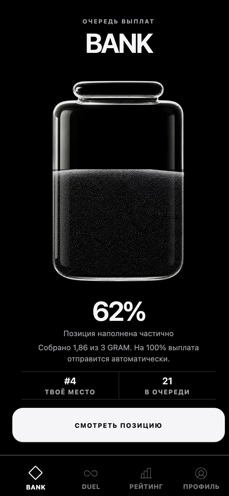
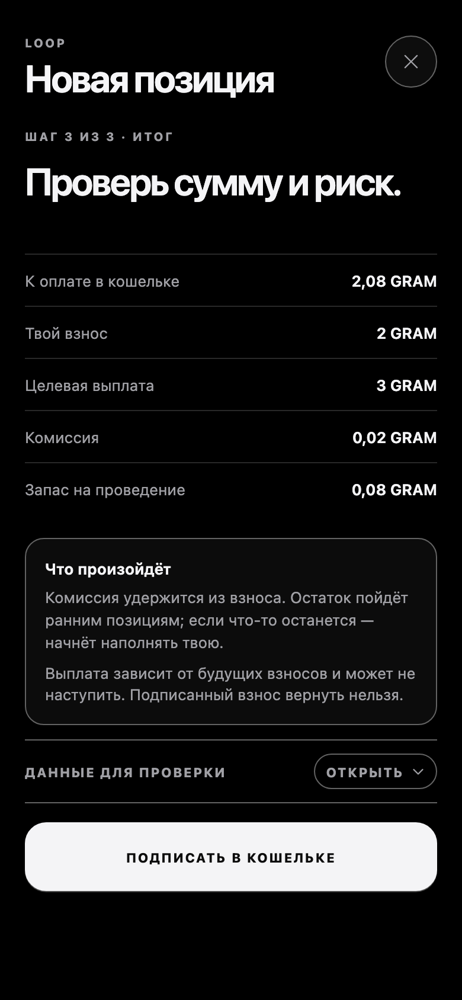
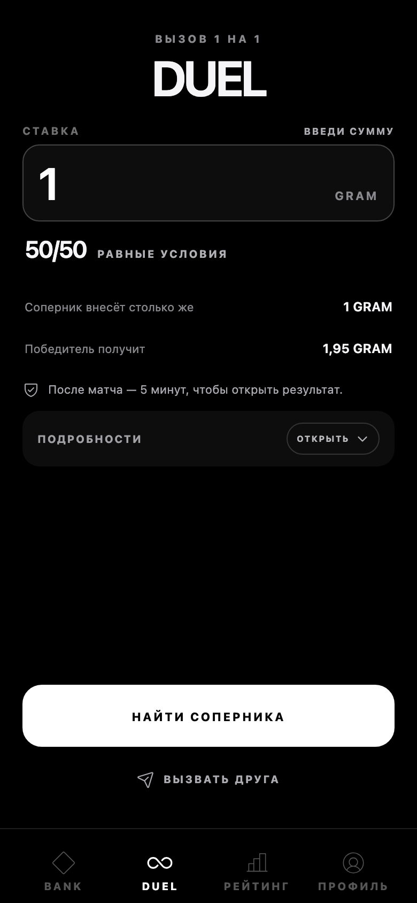
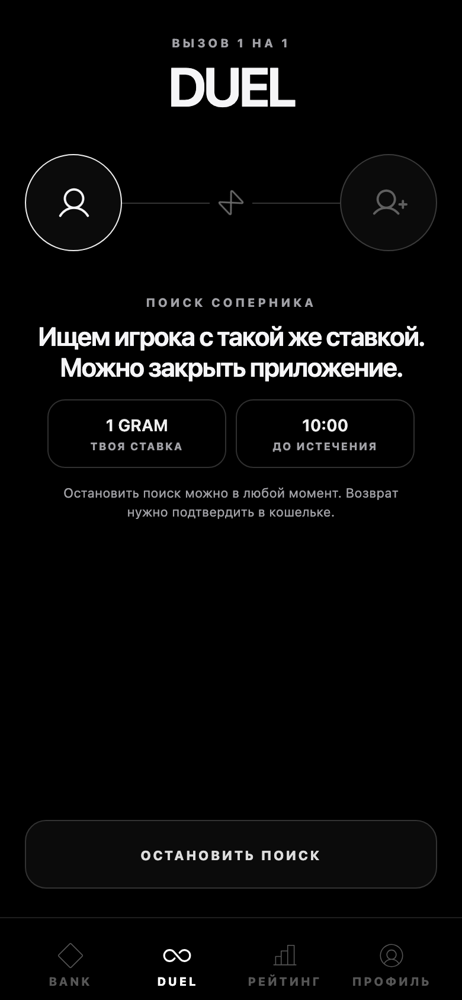
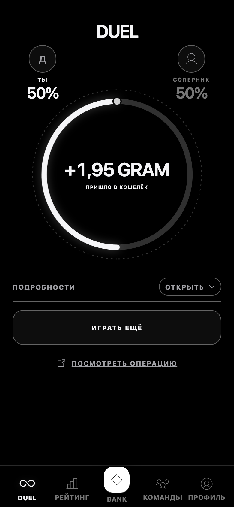
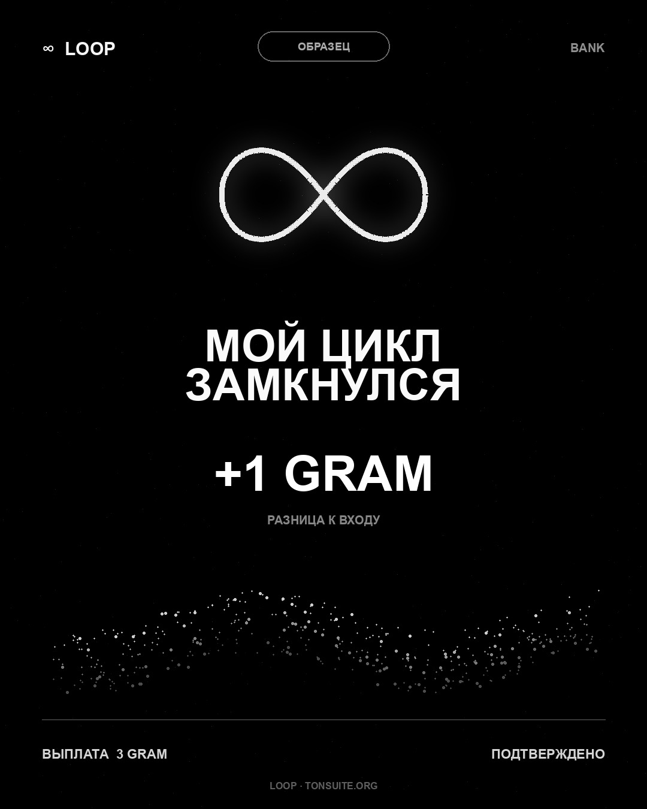
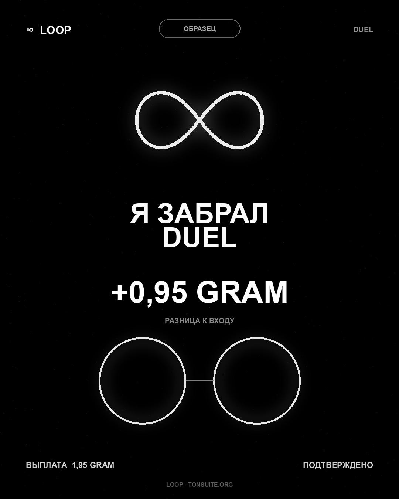

# LOOP

LOOP — открытое социальное приложение в Telegram на базе TON. В BANK участники занимают место в очереди, а в DUEL начинают вызов с равных шансов и могут усиливать свою сторону до раскрытия результата. Приложение не хранит средства: действия с GRAM подтверждаются во внешнем кошельке, а результат можно проверить в блокчейне.

[Открыть в Telegram](https://t.me/getloopbot?startapp) · [Посмотреть сайт](https://app.tonsuite.org) · [Исходный код](https://github.com/rub1kub/loop)

> Сейчас LOOP работает в тестовой сети и использует только тестовые GRAM. BANK намеренно воспроизводит модель финансовой пирамиды: выплаты зависят от новых участников и могут остановиться. Не отправляйте на адреса контрактов активы из основной сети.

## Как работает LOOP

### BANK

Пользователь выбирает сумму и цель — 1,25×, 1,5× или 2× — и занимает место в очереди. Новые взносы сначала наполняют более ранние позиции. Когда выбранная цель достигнута, контракт сам отправляет выплату.

Чтобы первые участники не могли сразу занять очередь слишком крупными суммами, BANK начинает с лимита 5 GRAM. После 25 завершённых позиций лимит становится 10 GRAM, после 100 — 15 GRAM, затем прибавляет по 5 GRAM каждые 250 завершений, но никогда не превышает 100 GRAM.

Очередь движется только пока появляются новые позиции. Отменить подтверждённую позицию или забрать взнос раньше срока нельзя.

### DUEL

Можно позвать друга или найти соперника автоматически. Оба участника начинают с одинаковой суммы и шанса 50/50. После появления пары открывается минута: любой игрок может подтвердить дополнительный взнос и увеличить свою долю пула, а значит и шанс. Каждое позднее пополнение даёт ещё 20 секунд на ответ, но вся фаза ограничена тремя минутами и диапазоном 90/10.

Устройство каждого игрока заранее фиксирует скрытое значение. Раскрыть его можно только после окончания фазы усиления. Контракт определяет победителя пропорционально подтверждённым долям; сервер LOOP не может изменить ни взносы, ни шанс, ни результат.

Если один участник вовремя раскрывает своё значение, а второй нет, побеждает первый. Если этого не делает никто, контракт возвращает обоим их взносы. Сейчас контракт удерживает единую комиссию 2,5% с завершённого дуэля.

### Рейтинг

Рейтинг обновляется каждый месяц и показывает не размер кошелька, а надёжность участника. Очки начисляются за подтверждённые выплаты BANK, завершённые дуэли, своевременные действия и приглашённых друзей хотя бы с одной подтверждённой операцией. Суммы, прибыль, победы и поражения на место не влияют.

Профиль также собирает историю BANK и DUEL, статус PLUSH BRICK и подтверждения операций в одном месте. LOOP проверяет PLUSH BRICK во внешнем кошельке и показывает отметку, но она не меняет очередь или шанс победы.

<p align="center">
  <a href="https://plushbrick.fun/">
    
  </a>
</p>

## Как это выглядит

| BANK: пустая очередь                             | BANK: очередь движется                                     | BANK: создание позиции                                              |
| ------------------------------------------------ | ---------------------------------------------------------- | ------------------------------------------------------------------- |
|  |  |  |

| DUEL: условия                                     | DUEL: поиск соперника                                     | DUEL: результат                                     |
| ------------------------------------------------- | --------------------------------------------------------- | --------------------------------------------------- |
|  |  |  |

Остальные экраны находятся в каталоге [docs/screenshots](docs/screenshots/).

После подтверждённой выплаты LOOP создаёт карточку результата. Сумма и ссылка на
операцию берутся из уже проверенного события TON: пользователь не может подменить
их перед публикацией. Карточка появляется один раз в приложении, приходит личным
сообщением и публикуется через нативный выбор чата Telegram.

| Выплата BANK                                            | Победа в DUEL                                           |
| ------------------------------------------------------- | ------------------------------------------------------- |
|  |  |

## Открытый проект

Исходники интерфейса, бота, API, контрактов и тестов доступны в этом репозитории. Можно проверить правила, собрать свою версию или предложить изменение. Проект распространяется по лицензии MIT.

Финансовый результат определяют контракты, а не интерфейс и не ответы сервера. История, очередь и рейтинг меняются только после подтверждения операции в TON.

Опубликованные контракты:

- [BANK — BankQueue v1.3](https://testnet.tonviewer.com/kQCqjhisqfxDrsPOEMWFE6AI1OWBtIQy_VVfXZU25zD50Il3)
- [DUEL — DuelEscrow v1.3](https://testnet.tonviewer.com/kQD7JaRbyRrkGFzk9Xk3rfpRqNBSAUF2T-kXxfDlXYw4lg3M)

## Что находится в репозитории

| Каталог     | Содержимое                                                                 |
| ----------- | -------------------------------------------------------------------------- |
| `apps/web`  | Mini App, публичный сайт, панель владельца и проверки интерфейса           |
| `apps/api`  | API, Telegram-бот, обработчик операций TON, фоновые задачи и их тесты      |
| `contracts` | Контракты BANK и DUEL на Tolk                                              |
| `tests`     | Тесты контрактов BANK и DUEL на Acton                                      |
| `deploy`    | Прямое развёртывание на VPS, резервные копии и возврат к предыдущей версии |
| `docs`      | Устройство продукта, контрактов, тестов и сервера                          |

## Архитектура

```text
Обычный браузер ───────────────────────────► Статический лендинг

Telegram ─► Mini App ── Telegram initData ─┐
                                          ├─► FastAPI + aiogram ─┬─► PostgreSQL
Владелец ─► /control ── TON-подтверждение ─┘                     └─► Redis

Mini App или /control ─► внешний кошелёк ─► Тестовая сеть TON
                                             ├── BankQueue
                                             └── DuelEscrow
                                                      │
                                                      ▼
                                         Обработчик операций TON
                                                      │
                                                      ▼
                                                 PostgreSQL
                                                      │
                                                      ▼
                                     Доставщик карточек ─► Telegram
```

Обычный браузер получает только лендинг и не запускает Telegram, TON Connect или API продукта. PostgreSQL хранит данные приложения и подтверждённую историю, Redis — временные блокировки и ограничения частоты запросов. BANK и DUEL разделены на уровне API, таблиц, событий и контрактов.

Подробнее: [полная база знаний](docs/agents/README.md), [актуальное состояние](docs/agents/current-state.md), [устройство продукта](docs/product.md), [архитектура](docs/architecture.md), [BANK](docs/bank.md), [DUEL](docs/duel.md), [рейтинг](docs/rating.md) и [контракты](docs/contracts.md).

## Технологии

| Часть проекта | Технологии                                              |
| ------------- | ------------------------------------------------------- |
| Интерфейс     | React 19, TypeScript, Vite, Motion, TON Connect UI      |
| API и бот     | FastAPI, aiogram, SQLAlchemy, Alembic, Pydantic, Pillow |
| Данные        | PostgreSQL 17, Redis 8                                  |
| Контракты     | Tolk 1.4, Acton 1.0, TVM                                |
| Проверки      | pytest, Vitest, Playwright, Ruff, mypy, Acton           |
| Сервер        | Docker Compose, Apache, nginx, systemd                  |

## Быстрый запуск

Нужны Node.js 22+, Python 3.12+, Docker и Acton 1.0. Команда `make setup` вызывает `python3`, поэтому этот исполняемый файл должен вести на Python 3.12 или новее.

```bash
cp .env.example .env
make setup
```

Запуск интерфейса с локальной имитацией Telegram:

```bash
VITE_MOCK_TELEGRAM=true make dev
```

В этом режиме нет настоящей авторизации, подписи транзакций и отправки средств.

Запуск PostgreSQL, Redis, API, обработчика TON и доставщика карточек:

```bash
cp .env.example .env.production
make docker-up
```

Все параметры окружения и варианты запуска описаны в [docs/setup.md](docs/setup.md).

## Проверки

Основные проверки проекта:

```bash
make lint
make typecheck
make test
make test-e2e
make test-security
```

Локальная сборка и тесты контрактов:

```bash
make contracts-build
make contracts-test
```

Строгий технический профиль перед основной сетью:

```bash
make contracts-mainnet-technical
```

Пакет исходников и доказательств для независимого аудита:

```bash
make contracts-audit-pack
```

После получения отчёта, заполнения `deployments/mainnet/release.json` и
подготовки mainnet-контрактов:

```bash
make contracts-mainnet-preflight
```

Preflight работает по принципу fail-closed: без проверяемого отчёта аудита,
совпадающего коммита, лимитов и сетевых доказательств выпуск не разрешается.

Проверка кода и состояния опубликованных контрактов:

```bash
make contracts-verify
make contracts-inspect
```

Полный список команд доступен через `make help`, а границы наборов тестов описаны в [docs/testing.md](docs/testing.md).

## Развёртывание

Рабочая версия загружается прямо на VPS по SSH. GitHub Actions в выпуске не участвует.

```bash
npm run deploy:vps
```

Если менялись только сайт или Mini App, используется отдельный выпуск без перезапуска серверных сервисов:

```bash
npm run deploy:vps:web
```

Полный выпуск создаёт резервную копию, применяет миграции, запускает сервисы и проверяет их состояние. Подробности и порядок возврата к предыдущей версии описаны в инструкции.

Подробная инструкция: [docs/deployment.md](docs/deployment.md).

## Ограничения и безопасность

- BANK не создаёт доход сам по себе. Без новых позиций выплаты останавливаются на неопределённый срок.
- Подтверждённую позицию BANK нельзя отменить или вернуть раньше достижения цели.
- В DUEL можно потерять весь подтверждённый взнос, включая усиления. Текущая единая комиссия контракта — 2,5% от общего пула завершённой игры.
- Контракты BANK и DUEL работают только с тестовыми GRAM. Проверка PLUSH BRICK выполняется отдельно в основной сети и не меняет комиссию.
- LOOP не получает секретные фразы или закрытые ключи пользователей и не ведёт внутренний пользовательский баланс.
- Владелец может вывести только свободный остаток сверх обязательств перед пользователями и сохраняемого резерва, только в казначейство и только после приостановки контракта.

Подробнее о границах доверия и сообщении об уязвимостях: [docs/security.md](docs/security.md) и [SECURITY.md](SECURITY.md).

## Документация

- [Полная база знаний проекта](docs/agents/README.md)
- [Актуальное production и mainnet-состояние](docs/agents/current-state.md)
- [Продуктовые решения, полномочия и риски](docs/agents/decisions-and-risks.md)
- [Конфигурация](docs/agents/configuration.md)
- [Настройка окружения](docs/setup.md)
- [Telegram Mini App и бот](docs/telegram.md)
- [Работа с TON](docs/ton.md)
- [Развёртывание и возврат версии](docs/deployment.md)
- [История изменений](CHANGELOG.md)

## Участие в разработке

Изменения оформляются в формате Conventional Commits и должны проходить связанные проверки. Порядок работы описан в [CONTRIBUTING.md](CONTRIBUTING.md).

## Лицензия

[MIT](LICENSE)
